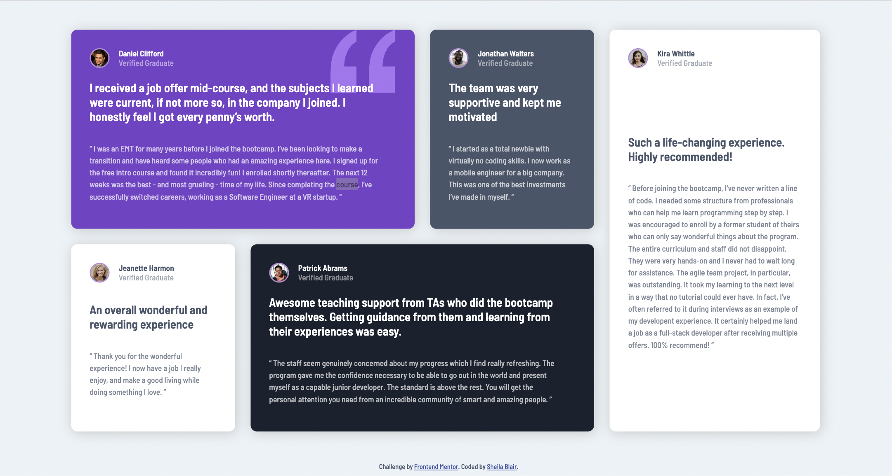

# Frontend Mentor - Testimonials grid section solution

This is a solution to the [Testimonials grid section challenge on Frontend Mentor](https://www.frontendmentor.io/challenges/testimonials-grid-section-Nnw6J7Un7). Frontend Mentor challenges help you improve your coding skills by building realistic projects. 

## Table of contents

- [Overview](#overview)
  - [The challenge](#the-challenge)
  - [Screenshot](#screenshot)
  - [Links](#links)
- [My process](#my-process)
  - [Built with](#built-with)
  - [What I learned](#what-i-learned)
  - [Continued development](#continued-development)
- [Author](#author)

## Overview

### The challenge

Users should be able to:

- View the optimal layout for the site depending on their device's screen size

### Screenshot

### Links

- [Solution](https://www.frontendmentor.io/solutions/testimonials-grid-using-html-and-css-zfkbxKe7kD)
- [Live Site](https://sheblair.github.io/testimonials-grid-section-main/)

## My process

1. started with CSS Flexbox
2. realized I could build the mobile site with Flexbox but I would need CSS grid to make the desktop layout work
3. tried to figure out CSS grid and got really overwhelmed and got stuck
4. took a couple of days off, then came back. watched a short tutorial on egghead.io, read through CSS grid on css-tricks.com for the 10th or 15th time, and started over
5. this time something was clicking and I was able to figure out how to get the appropriate columns and how to reposition my grid items according to the design mockup
6. got stuck again because there was all this extra white space after my grid items and I couldn't figure out where it was coming from. spent a long time on Stack Overflow and Google trying to figure this out.
7. finally had my eureka/facepalm moment when I realized that in my mobile CSS, the width of the grid items was set to 87%. I changed this to 100% and voila, the grid items slid nicely into place--no more extra white space!

*PART TWO*
- So I thought I had my layout all setup but then I realized there was an odd space between my first and second testimonial blocks that was causing a shift. It took me **ages** to figure out what was causing this, because I assumed it had something to do with how I'd set up my grid initially. I confirmed, by looking at a few other solution codes, that in fact my grid was set up properly. So then it just became a task of scanning through my CSS, line by line, trying to figure out what innocent-seeming thing was causing this weird break in the layout. It ended up being a width property set to 90% on my class for styling all my testimonial blocks. I had the width set to 90%, probably way back from when I started the project using Flexbox instead of grid, and once I unchecked the box in DevTools the layout break disappeared! Hallelujah.
- Then I had to set about creating an appropriate layout for my tablet styles, because even though that's not part of the challenge description, it bothers me to build a responsive site that doesn't have a nice and unique layout for tablet screen sizes.
- After building a nice tablet layout, I realized that now my tablet styles were breaking my desktop layout, so I went into the desktop styles and added some more CSS to fix those issues. 
- And with that, my project was finally complete!!!
- Oh - I also added a box-shadow to the testimonials, which made it look more like the design, and I also added a top margin on the desktop layout so that it wouldn't sit flush to the top of the screen, because I think it looks nicer that way. On phone and tablet sizes, I don't mind the content aligning flush with the top, but for some reason it doesn't work on desktop. And that's it!

### Built with

- Semantic HTML5 markup
- CSS custom properties
- Flexbox
- CSS Grid
- Mobile-first workflow

### What I learned

This was truly a challenge for me. I had to stop and take a day or two off here and there before I was finally able to finish it, mostly because I had actually never used CSS Grid before trying this challenge, so it took a lot of error and experimentation to figure out how to use it. I learned a lot about how Grid works, including how powerful it is, and that you are able to position things pretty much wherever you want, which is an incredible thing to be able to do. I think I learned that Grid has much more flexibility than Flexbox and other CSS layouts I've been working with, so that was cool.

The other main thing I learned, and this is definitely not the first time I've encountered this nor will it be the last I'm sure, that some seemingly innocuous line of code can end up causing a kind of major issue. In this case, it was a width property that was causing my whole layout to break. I never would have guessed that this would be the cause of the issue. What this teaches me is to think outside the box when facing a mysterious issue--don't assume anything, let yourself scan through all the code and remember that it can be a very small thing, so just try everything. Use DevTools and just click on and off whatever you can think of, and eventually you'll find it.

### Continued development

I definitely want to keep working with and experimenting with CSS Grid. It was difficult at first but once I started feeling more confident and getting the hang of it, I realized how useful and powerful it is and how great a tool it really is. 

## Author

- Website - [Sheila Blair](https://github.com/sheblair)
- Frontend Mentor - [@sheblair](https://www.frontendmentor.io/profile/sheblair)

